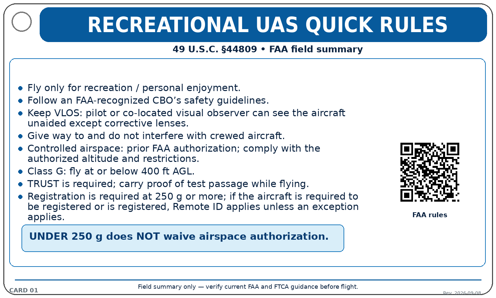
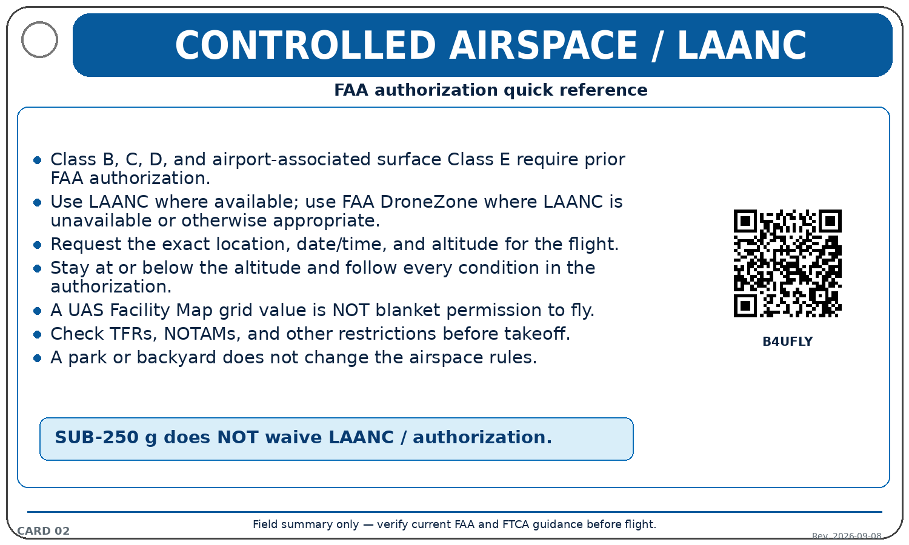
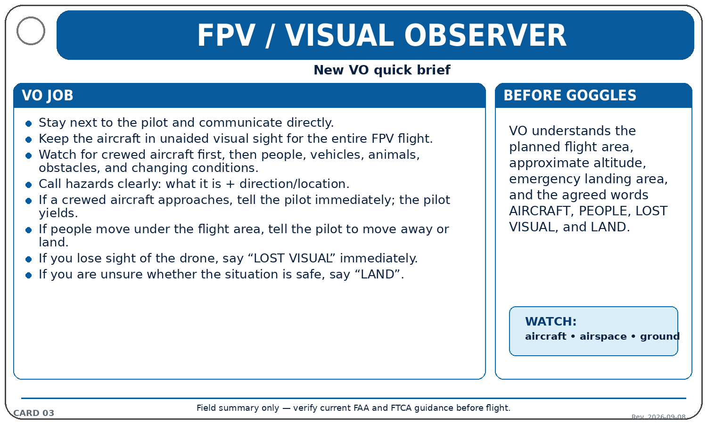
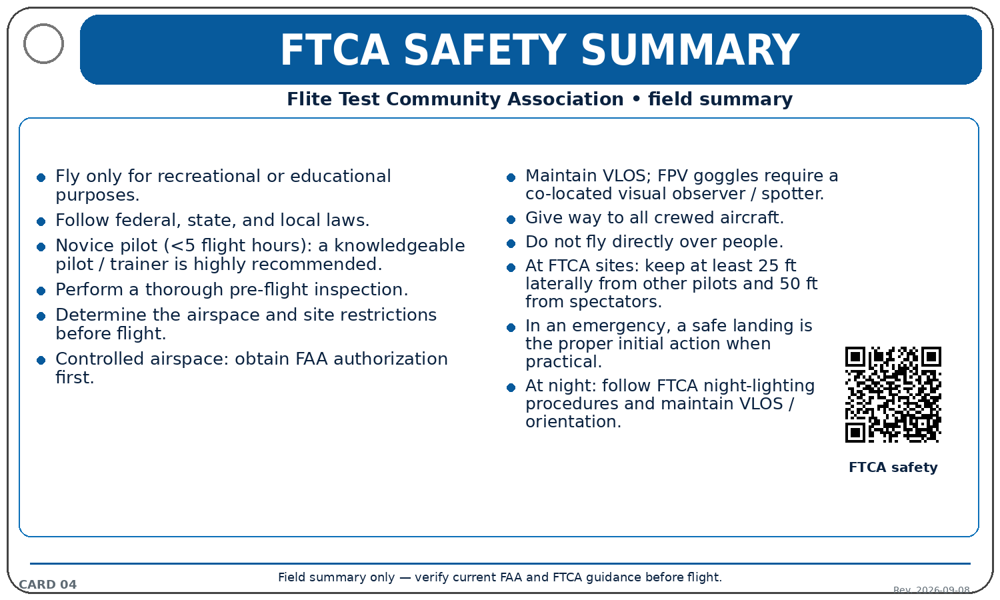

# FPV Pilot Field Cards

A free, printable set of **3 × 5 inch field-reference cards** for recreational FPV and model-aviation pilots in the United States.

The goal is simple: put the information a pilot is likely to need **in the flight bag**, in a format that is quick to scan, easy to laminate, and easy to expand on a binder ring.

> **Important:** These cards are a field-reference summary, not legal advice and not a replacement for current FAA regulations, FAA guidance, or the safety guidelines of the Community-Based Organization (CBO) you choose to follow.

## Why this exists

Getting into FPV and recreational model aviation can be overwhelming. New pilots are expected to learn airspace, FAA requirements, CBO safety practices, FPV visual-observer procedures, battery handling, equipment terminology, and pre-flight habits—all at once.

This deck was created to reduce that cognitive load by turning frequently needed information into small, rugged reference cards.

It is intended to be:

- **Free to download and print**
- **Easy to laminate** and carry on a binder ring
- **Modular** — add or remove cards as your flying changes
- **Useful for new pilots** without being limited to beginners
- **Traceable to source material** so regulatory cards can be reviewed and updated

## Current deck

| Card | Topic |
|---|---|
| 01 | Recreational UAS Quick Rules |
| 02 | Controlled Airspace / LAANC |
| 03 | FPV / Visual Observer |
| 04 | FTCA Safety Summary |
| 05 | Pre-Flight / Go-No-Go |
| 06 | Battery / LiPo Quick Reference |
| 07 | New Pilot Field Reference |
| 08A | What Does This Mean? — Regulatory / Airspace |
| 08B | What Does This Mean? — Aircraft / FPV / Battery |

The glossary is designed as a **duplex card**: 08A on the front and 08B on the back.

## Preview

### Recreational rules

### Controlled airspace / LAANC

### FPV / visual observer

### FTCA safety summary

## Printing

Each PNG is:

- **1500 × 900 pixels**
- **300 DPI**
- **3 × 5 inches, landscape**

Recommended field setup:

1. Print at **100% / actual size**.
2. Trim to 3 × 5 inches.
3. Laminate.
4. Round the corners if desired.
5. Punch the marked safe area and place the cards on a small binder ring.
6. Keep your actual TRUST certificate and, when applicable, registration or current flight authorization with your field materials.

Do not scale the images to “fit page” if you want the intended 3 × 5 size.

## CBO alignment

The CBO-specific card in this deck is aligned with the **Flite Test Community Association (FTCA)** safety guidelines because those guidelines are a strong fit for the educational and community-oriented purpose of this project.

This project is **not an official FTCA or Flite Test publication and is not endorsed by them unless they explicitly say otherwise**.

Pilots may choose any FAA-recognized CBO and are responsible for following the safety guidelines of the CBO they operate under.

## QR codes and sources

Regulatory and CBO cards use QR codes only where an online source is useful in the field. QR codes in the normalized release were generated programmatically and software-decoded during QA.

See:

- [Source references](SOURCES.md)
- [Deck manifest](docs/MANIFEST.md)
- [QA report](docs/QA_REPORT.md)

**Regulatory review date:** 2026-09-08

Because regulations, FAA guidance, online services, and CBO guidance can change, always verify current information before relying on an older release.

## Contributing

Corrections, updated source references, accessibility improvements, and ideas for additional cards are welcome.

Please see [CONTRIBUTING.md](CONTRIBUTING.md). For regulatory changes, include a primary source whenever possible.

## License

The original card layout, compilation, and project documentation are released under the **Creative Commons Attribution 4.0 International (CC BY 4.0)** license.

You may copy, print, redistribute, adapt, and commercially reproduce the project provided the required attribution is preserved. See [LICENSE.md](LICENSE.md).

Third-party names, trademarks, regulations, and linked source material remain the property of their respective owners and are not relicensed by this project.
